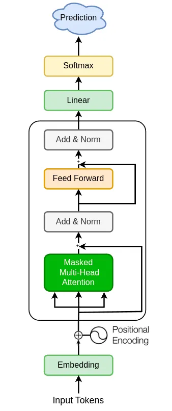
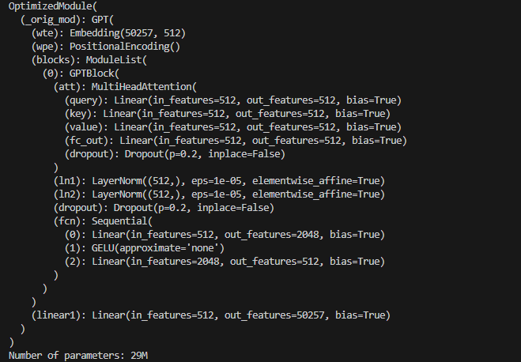
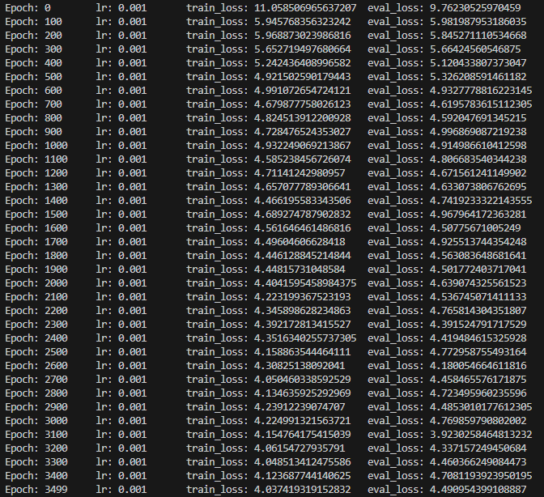
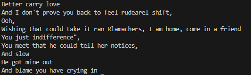

# GPT-2

An implementation of "Language Models are Unsupervised Multitask Learners" by Radford _et al._

Resources:

- [Radford, A., Wu, J., Child, R., Luan, D., Amodei, D., & Sutskever, I. (2019). Language models are unsupervised multitask learners. OpenAI Blog, 1(8), 9.](https://cdn.openai.com/better-language-models/language_models_are_unsupervised_multitask_learners.pdf)
- ["The Illustrated GPT-2 (Visualizing Transformer Language Models)" by Jay Alammar](https://jalammar.github.io/illustrated-gpt2/)
- ["Build an LLM Model (From Scratch)" by Amit Kharel](https://pub.towardsai.net/heres-how-you-can-build-and-train-gpt-2-from-scratch-using-pytorch-0253d01d2b63)
